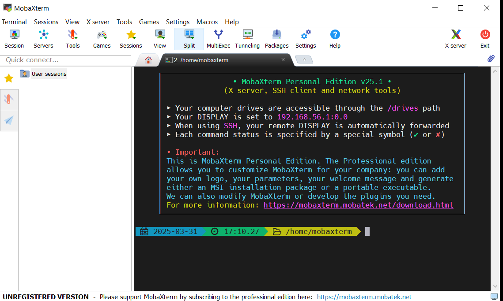

# ENVIRONMENT SETUP DOCUMENTATION

The following provides a comprehensive guide to the setting of development environment which includes the following installation Visual Studio Code,VirtualBox,Ubuntu and the setup of GitHub and AWS account.Screenshot inclusive for further clarity.

### Tools needed to be installed

1. Visual studio code
2. Git
3. Virtual box
4. Ubuntu on virtual box 


### Accounts To Be Created
1. GitHub  Account
2. Amazon Web Service(AWS) Account

## INSTALLING VISUAL STUDIO CODE
successfully installed visual studio code by folowing these following steps

1. Navigated to the https://code.visualstudio.com/
2. Downloaded the window installer.
3. Opened the downloaded file and followed the installation prompts.
4. verified the installation by launching visual studio code


__Image showing the welcome page of the vs code__


## INSTALLING GIT
I successfully installed Git by following these steps
1. ran the required commands to install git on the terminal

```
sudo apt update
```

```
sudo apt install git -y
```

###### verify installation:

```
git --version
```


###### Basic Git Setup

```python
git config --global user.name "Favour Bassey"
git config --global user.email "phaebybassey@gmail.com"
gitt add .
git  commit -m "commit message"
git push
Git merge
git branch
```


__Image showing APT updating before the installation of git on cli__


__Image showing git installing using the cli__

## INSTALLING VIRTUALBOX
I successfully installed virtualBox by following the steps

1. navigated to the [official VirtualBox Website](https://www.virtualbox.org/)
2. Downloaded the Window version of virtualBOX
3. Opened the installer and followed the on-screen instructions
4. Launched the installation by confirming virtualBox.


__Image showing Ubuntu running on the virtualbox__

## INSTALLING UBUNTU
Successfully installed the Ubuntu on VirtualBox following these steps.
1.Navigated to the ubuntu ISO file from the [official Ubuntu website](https://ubuntu.com/)
2. Created a new virtual machine in VirtualBox and selected the downloaded ISO file
3. followed the installation steps required in the virtual machine
4. The running of ubuntu in the virtual mahine was confirmed.


__Image show the command line interface of the Ubuntu OS with some ran codes__


## INSTALLING MOBAXTERM
I successfully installed MobaXterm by following the steps

1. Mavigated to the [MOBAXTERM](https://mobaxterm.mobatek.net/) 
2. Downloaded the Window version of MobaXterm
3. Opened the installer and followed the on-screen instructions
4. Launched the installation by confirming MobaXterm.
   

__Image of the installed MobaXterm__


## INSTALLING GIT BASH
I successfully installed Git Bash by following the steps

1. Navigated to the [Git website](https://git-scm.com/)
2. Downloaded the Window version of Git Bash
3. Opened the installer and followed the on-screen instructions
4. Launched the installation by confirming.
   

__Image of installed GitBash__


## SETTING UP A GITHUB ACCOUNT
the setting up of my github account was done successfully following the guide:
1. The official site of [GitHub](https://github.com/) was visited
1. Clicked on the "Sign Up" button and inputted the required fields.
1. verified my email address and completed the account setup process.
1. configured git on my local machine to connect with my github account.


__Image of GitHub dashboard__

